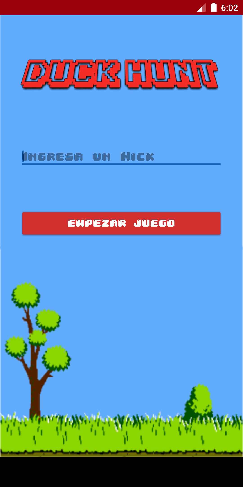
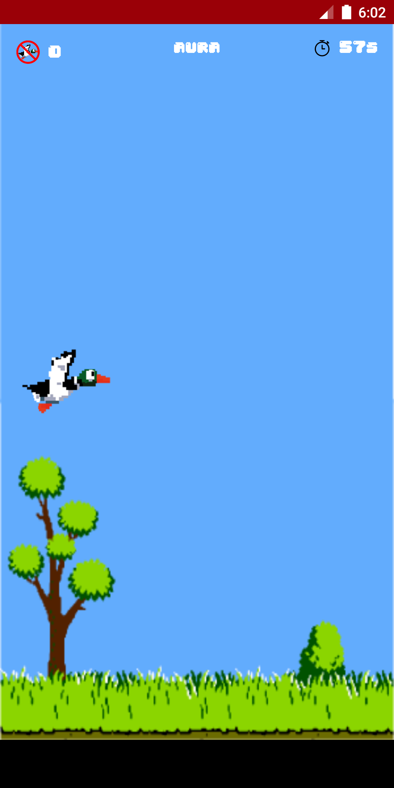
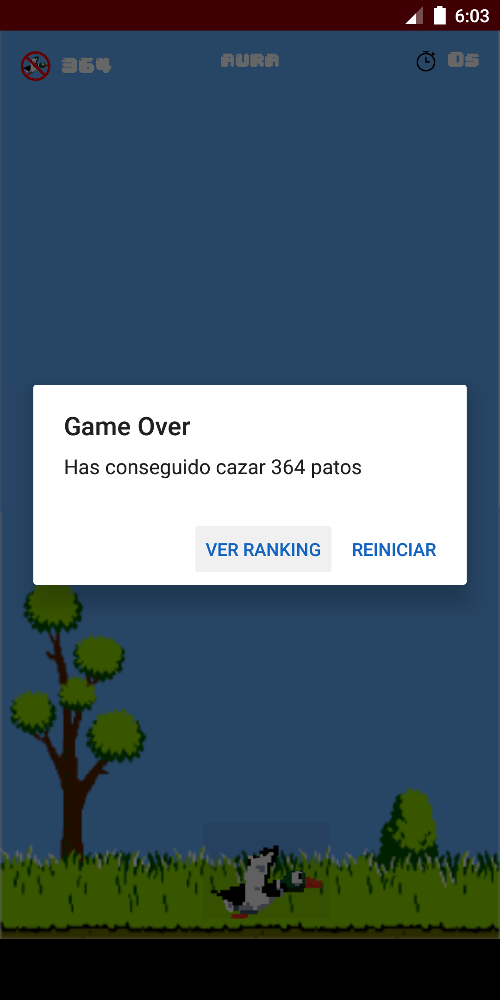

 
**Duck Hunt** es una aplicación basada en el mitico juego de NES, en el cual se implementa dos funcionalidades de Firebase que es Auth y Firestore.

# Capturas de Pantalla

 

  

## Librerias usadas:

* **DataBase** - Datos Almacenados.
	* **Firestore** - Los datos de la Conferencia se almacenan en Firestore para actualizar información de forma remota.
	* **Auth** - Aunteticación de forma anonima administrada por medio de Firebase.
